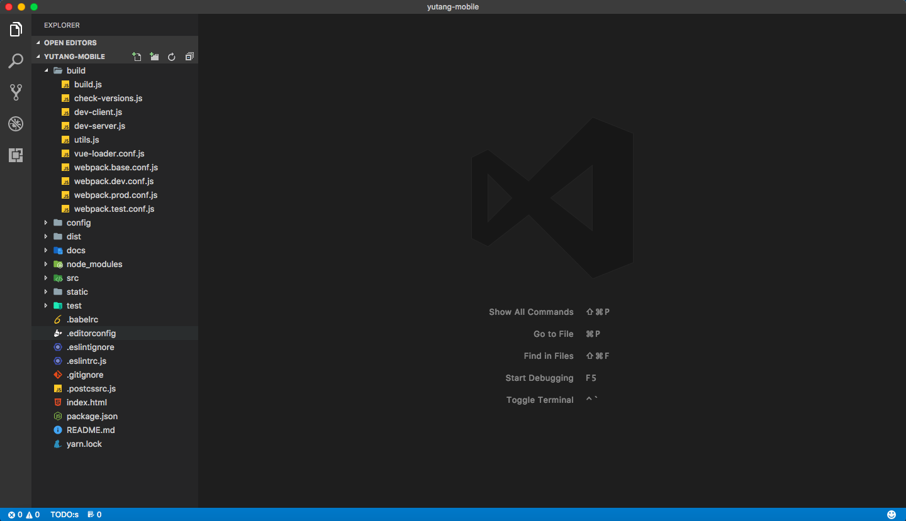

## 目录结构

* `/build` 构建代码
* `/config` 配置构建环境的代码
* `/dist` 打包后自动生成的代码
* `/docs` 项目详细说明文档
* `/node_modules` 项目依赖
* `/src` 源代码
* `/static` 静态文件
* `/test` `unit` `e2e` 等测试代码
* `/.babelrc`  [babel](https://babeljs.io/) 配置
* `/.editorconfig` 代码一致性开源项目，支持 `sublime text`  `atom` `vscode` `*strom` `xcode` 等常见编辑器和 `IDE`
* `/.eslintignore` 不需要代码检查的目录
* `/.eslintrc` [eslint](http://eslint.cn/)配置
* `/.gitignore` 不需要 `git` 追踪的目录
* `/.postcssrc` [postcss](https://github.com/michael-ciniawsky/postcss-load-config) 配置
* `/package.json` 项目元信息配置
* `/index.html` 单页面应用的唯一  `html`
* `/README`  项目介绍，即现在读到的内容
* `/yarn.lock` [yarn](https://yarnpkg.com/zh-Hans/) 辅助依赖管理

## 使用详情
http://git.dayuw.org/1renhao/dayu-vue-spa-boilerplate/tree/master

## 内部UI（src/components/common）
UI参考：https://github.com/ElemeFE/mint-ui/blob/master/packages/message-box/src/message-box.vue
1. Tab.vue tab选项卡 (希望给con加上过度transition)
2. Scroller.vue 下拉加载 https://github.com/eightfeet/vue-scrolllist
3. Dialog.vue 弹窗 https://github.com/fangyongbao/cubeex/blob/master/src/components/dialog/index.vue
4. Calendar.vue 日历 https://github.com/fangyongbao/cubeex/blob/master/src/components/datetime/index.vue
5. Toast/ 信息提示弹窗 https://github.com/webjyh/vue-tooltips/blob/master/README.md

## 插件引用
1. vue-scroller 下拉加载，上拉刷新 https://github.com/wangdahoo/vue-scroller

## 问题集锦
1. ~~缺信息提示组件~~ components/common/Toast/
2. ~~时间选择工具~~ components/common/Calendar.vue
3. ~~接口代理测试~~
    设置：about.js
    proxyTable: {
      '/api': {
        target: 'http://jkt.dayuw.cn',
        changeOrigin: true
      }
    }
4. ~~绑定线上CDN设置~~  更改config/index.js 下的assetsPublicPath值为线上CDN即可
5. ~~使用flexible 不编译字体~~ 字体后面加/*px*/
6. ~~对应的图片该怎么处理~~ 全部尺寸使用rem即可
7. ~~服务器在本地怎么处理~~ 和问题3处理方法一致
8. ~~可以在微信开发工具中使用么~~ 输入页面地址即可
